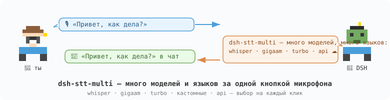

# dsh-stt-multi



[]() []() []()

Мульти-провайдерное распознавание речи для [DeepSeek Harness](https://github.com/deepseek-ai/deepseek-harness):
локальный **Whisper**, **GigaAM v2** (лучший для русского) и OpenAI-совместимые облачные API за родной
кнопкой микрофона DSH — каждая модель выбирается в настройках, без правки кода приложения.

## Зачем

Штатный речевой плагин DSH ставит **одну** модель (SenseVoice) с фиксированным набором языков
(zh/yue/en/ja/ko — без русского) и **без выбора**. `dsh-stt-multi` превращает этот список
в настоящий переключатель моделей: несколько движков (Whisper tiny→turbo, GigaAM v2,
кастомные sherpa-модели, облачные API), много языков (ru, en, 中文 и остальные 90+ у Whisper),
один движок на инстанс — переключай хоть на каждую запись, всё за той же родной кнопкой.

## Движки

| Движок | Модель | Языки | Размер | Заметки |
| Whisper small (int8) | `whisper-small` | ru, en + multilingual | ~370 MB | **Дефолт** — лучший баланс |
| Whisper tiny (int8) | `whisper-tiny` | ru, en + multilingual | ~100 MB | Быстрый, грубоватый RU |
| Whisper large-v3-turbo | `whisper-turbo` | ru, en + multilingual | ~800 MB | Лучшее качество Whisper |
| GigaAM v2 (CTC int8) | `gigaam-v2` | **ru** | ~236 MB | RU-специалист, MIT |
| Кастомная | `modelDirectory` | любые sherpa-совместимые | — | файлы есть = работает, без хэшей |
| Облачный API | `baseUrl` + ключ | зависит от API | 0 | OpenAI-совместимые (Groq, OpenAI, …) |

Модели скачиваются автоматически (GitHub k2-fsa + HF/hf-mirror фолбэк, sha256-проверка)
в `~/.dsh/speech-to-text/`. Бинари моделей никогда не кладутся в npm-пакет.

## Установка

Из npm (рекомендуется):

```bash
# inside a DSH profile (~/.dsh/profiles/<name>/):
dsh plugin --profile <name> add dsh-stt-multi
```

Из релизного тарболла (реестр npm не нужен):

```bash
dsh plugin --profile <name> add https://github.com/SerzhSharapa/dsh-stt-multi/releases/download/v0.6.0/dsh-stt-multi-0.6.0.tgz
```

> Примечание: `dsh plugin` требует `pnpm` в PATH. DSH поставляет свой:
> `export PATH="/Applications/DeepSeek Harness.app/Contents/Resources/runtime/pnpm/bin:$PATH"`
> (or create a shim running `node .../pnpm/bin/pnpm.cjs "$@"`).

Затем добавь бандл в `package.json` профиля:

```json
"dsh": { "profile": { "bundles": [
  "@deepseek-ai/dsh-base",
  "@deepseek-ai/dsh-experimental-voice-input-bundle",
  "@deepseek-ai/dsh-web-app",
  "dsh-stt-multi"
] } }
```

Плагин из коробки включает два движка (`whisper-small`, `whisper-tiny`) и запись
`gigaam-local`. Больше моделей = больше записей в `cordis.patch.yml` профиля:

```yaml
- insert:
    - id: whisper-turbo          # уникальный id инстанса
      name: dsh-stt-multi
      config:
        providerId: whisper-turbo
        modelId: whisper-turbo
```

### Кастомная локальная модель (CUSTOM-01)

```yaml
- insert:
    - id: my-model
      name: dsh-stt-multi
      config:
        providerId: my-model
        modelDirectory: /absolute/path/to/sherpa-whisper-model  # encoder*/decoder*/tokens*
```

### Облачный API-провайдер

```yaml
- insert:
    - id: stt-api
      name: dsh-stt-multi
      config:
        providerId: stt-api
        baseUrl: https://api.groq.com/openai/v1/
        apiKeyEnv: GROQ_API_KEY     # key read from env — never stored in profile config
        apiModel: whisper-large-v3
```

Облачные движки помечены `☁️ … (cloud)` — аудио покидает машину;
всё остальное полностью локально.

## Конфигурация (на инстанс)

| Опция | Дефолт | Описание |
|--------|---------|-------------|
| `providerId` | `whisper-local` | id инстанса в настройках DSH |
| `modelId` | `whisper-small` | модель каталога (tiny/small/turbo/gigaam-v2) |
| `modelDirectory` | — | кастомная директория sherpa-модели (перекрывает modelId) |
| `language` | `ru` | языковая подсказка (`auto` → `ru` для whisper) |
| `threads` | `2` | потоки CPU для инференса |
| `echo` | `false` | debug-режим: без нативного инференса |
| `baseUrl` / `apiKeyEnv` / `apiModel` | — | облачный провайдер (см. выше) |

## Разработка

```bash
npm install && npm run build && npm test
node scripts/smoke-native.mjs ~/.dsh/profiles/<name>/node_modules  # нативный smoke (plain node)
ELECTRON_RUN_AS_NODE=1 "/Applications/DeepSeek Harness.app/Contents/MacOS/DeepSeek Harness" \
  scripts/smoke-native.mjs ~/.dsh/profiles/<name>/node_modules     # реальный Electron-рантайм
```

Проверено с DSH 0.2.0-rc.2 (cordis 4.0.4, sherpa-onnx-node 1.13.8, Electron 44).

## Приватность

Локальные движки никуда не отправляют аудио — инференс идёт в изолированном локальном воркер-процессе.
Облачные провайдеры только по явному включению и явно помечены.

## Лицензии

- Этот плагин: MIT
- Веса GigaAM v2: MIT (salute-developers/GigaAM)
- Модели остаются собственностью их издателей; качаются в рантайме, не перераспространяются.

## Роадмап

- [x] Фаза 1 — скелет плагина и регистрация провайдера (+ нативный smoke в Electron)
- [x] Фаза 2 — загрузка моделей (зеркала, sha256, докачка)
- [x] Фаза 3 — настоящий Whisper-воркер end-to-end (русская диктовка)
- [x] Фаза 4 — список моделей мульти-инстансами + кастомные modelDirectory
- [x] Фаза 5 — GigaAM v2 + OpenAI-совместимый API-провайдер
