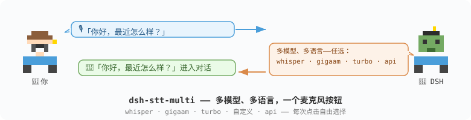

[中文](README.zh.md) | [English](README.md) | [Русский](README.ru.md)

# dsh-stt-multi



[]() []() []()

面向 [DeepSeek Harness](https://github.com/deepseek-ai/deepseek-harness) 的多引擎语音识别：
本地 **Whisper**、**GigaAM v2**（俄语最强）以及 OpenAI 兼容云端 API，接入原生 DSH 麦克风按钮——
每个模型都可在语音设置中切换，无需改动应用代码。

## 为什么需要

DSH 自带语音插件只内置**一个**模型（SenseVoice）——不能换模型、不能换引擎，
语言也仅限 zh/yue/en/ja/ko。`dsh-stt-multi` 把语音设置列表变成真正的选择器：多个引擎
（Whisper tiny→turbo、GigaAM v2、自定义 sherpa 模型、云端 API）、多种语言
（中文、English、Русский 及 Whisper 支持的其余 90+ 种），一个实例一个引擎——每次录音都能换，
全都挂在原生麦克风按钮后面。

## 引擎

| 引擎 | 模型 | 语言 | 体积 | 说明 |
|--------|-------|-----------|------|-------|
| Whisper small (int8) | `whisper-small` | 90+ 种语言 | ~370 MB | **默认**——质量与体积最均衡 |
| Whisper tiny (int8) | `whisper-tiny` | 90+ 种语言 | ~100 MB | 快，精度略低 |
| Whisper large-v3-turbo | `whisper-turbo` | 90+ 种语言 | ~800 MB | Whisper 最佳质量 |
| GigaAM v2 (CTC int8) | `gigaam-v2` | 仅俄语 | ~236 MB | 俄语最强，MIT |
| 自定义 | `modelDirectory` | 任意 sherpa 兼容模型 | — | 文件放好即生效，不校验哈希 |
| 云端 API | `baseUrl` + 密钥 | 取决于 API | 0 | OpenAI 兼容（Groq、OpenAI 等） |

模型自动下载（GitHub k2-fsa + HF/hf-mirror 镜像回退，sha256 校验）到 `~/.dsh/speech-to-text/`。
npm 包中绝不携带模型文件。

## 安装

从 npm 安装（推荐）：

```bash
# inside a DSH profile (~/.dsh/profiles/<name>/):
dsh plugin --profile <name> add dsh-stt-multi
```

从发布包安装（无需 npm 源）：

```bash
dsh plugin --profile <name> add https://github.com/SerzhSharapa/dsh-stt-multi/releases/download/v0.6.0/dsh-stt-multi-0.6.0.tgz
```

> 注意：`dsh plugin` 需要 PATH 中有 `pnpm`。DSH 自带一份：
> `export PATH="/Applications/DeepSeek Harness.app/Contents/Resources/runtime/pnpm/bin:$PATH"`
> (or create a shim running `node .../pnpm/bin/pnpm.cjs "$@"`).

然后把 bundle 加入该 profile 的 `package.json`：

```json
"dsh": { "profile": { "bundles": [
  "@deepseek-ai/dsh-base",
  "@deepseek-ai/dsh-experimental-voice-input-bundle",
  "@deepseek-ai/dsh-web-app",
  "dsh-stt-multi"
] } }
```

插件开箱自带两个引擎（`whisper-small`、`whisper-tiny`）和 `gigaam-local` 条目。
要更多模型，在 profile 的 `cordis.patch.yml` 里加更多条目：

```yaml
- insert:
    - id: whisper-turbo          # 唯一实例 id
      name: dsh-stt-multi
      config:
        providerId: whisper-turbo
        modelId: whisper-turbo
```

### 自定义本地模型 (CUSTOM-01)

```yaml
- insert:
    - id: my-model
      name: dsh-stt-multi
      config:
        providerId: my-model
        modelDirectory: /absolute/path/to/sherpa-whisper-model  # encoder*/decoder*/tokens*
```

### 云端 API 引擎

```yaml
- insert:
    - id: stt-api
      name: dsh-stt-multi
      config:
        providerId: stt-api
        baseUrl: https://api.groq.com/openai/v1/
        apiKeyEnv: GROQ_API_KEY     # key read from env — never stored in profile config
        apiModel: whisper-large-v3
```

云端引擎在列表中标记为 `☁️ … (cloud)`——音频会离开本机；
其余全部本地运行。

## 配置（每个实例）

| 选项 | 默认值 | 说明 |
|--------|---------|-------------|
| `providerId` | `whisper-local` | 显示在 DSH 设置中的实例 id |
| `modelId` | `whisper-small` | 目录中的模型（tiny/small/turbo/gigaam-v2） |
| `modelDirectory` | — | 自定义 sherpa 模型目录（覆盖 modelId） |
| `language` | `ru` | 语言提示（`auto` 用实例默认值） |
| `threads` | `2` | 推理所用 CPU 线程 |
| `echo` | `false` | 调试模式：不做原生推理 |
| `baseUrl` / `apiKeyEnv` / `apiModel` | — | 云端引擎（见上文） |

## 开发

```bash
npm install && npm run build && npm test
node scripts/smoke-native.mjs ~/.dsh/profiles/<name>/node_modules  # 原生冒烟（plain node）
ELECTRON_RUN_AS_NODE=1 "/Applications/DeepSeek Harness.app/Contents/MacOS/DeepSeek Harness" \
  scripts/smoke-native.mjs ~/.dsh/profiles/<name>/node_modules     # 真实 Electron 运行时
```

已在 DSH 0.2.0-rc.2（cordis 4.0.4、sherpa-onnx-node 1.13.8、Electron 44）上验证。

## 隐私

本地引擎绝不外发音频——推理运行在隔离的本地 worker 进程中。
云端引擎需显式开启并明确标记。

## 许可证

- 本插件：MIT
- GigaAM v2 权重：MIT（salute-developers/GigaAM）
- 模型版权归发布者所有；运行时下载，不随包分发。

## 路线图

- [x] 阶段 1 —— 插件骨架与引擎注册（+ Electron 原生冒烟）
- [x] 阶段 2 —— 模型资产与下载层（镜像、sha256、断点续传）
- [x] 阶段 3 —— 真 Whisper worker 端到端（俄语听写）
- [x] 阶段 4 —— 多实例模型列表 + 自定义 modelDirectory
- [x] 阶段 5 —— GigaAM v2 + OpenAI 兼容 API 引擎
